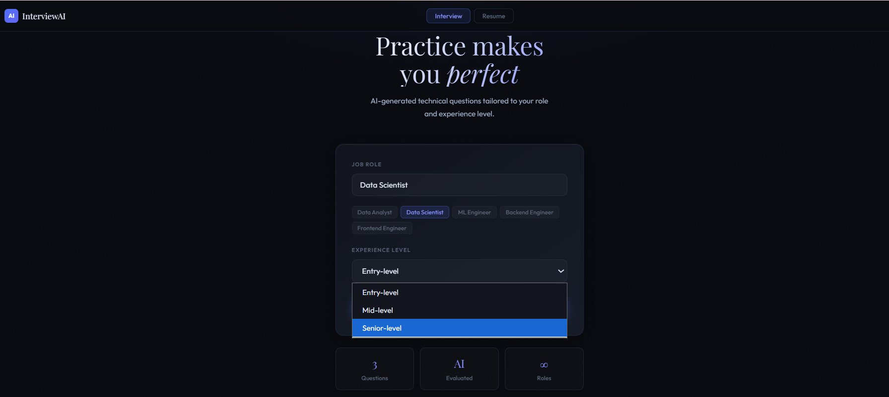
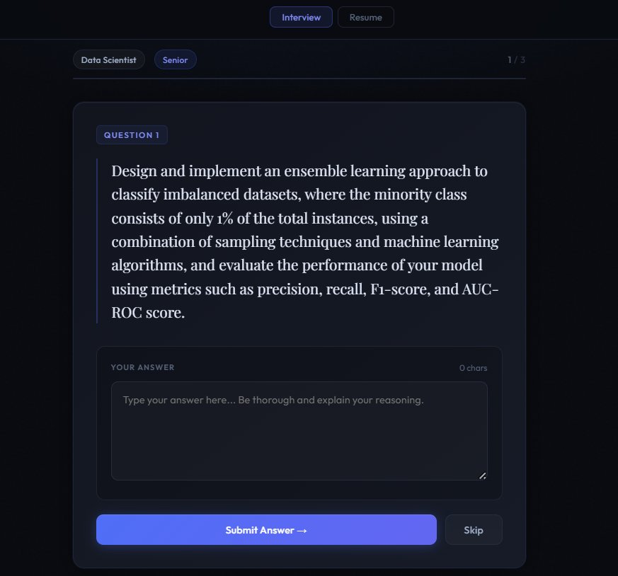
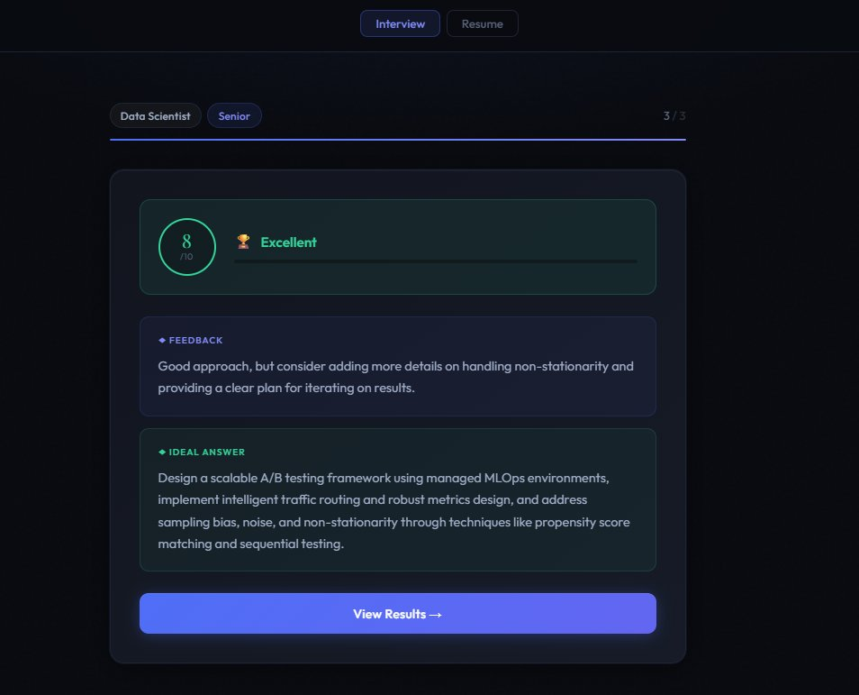
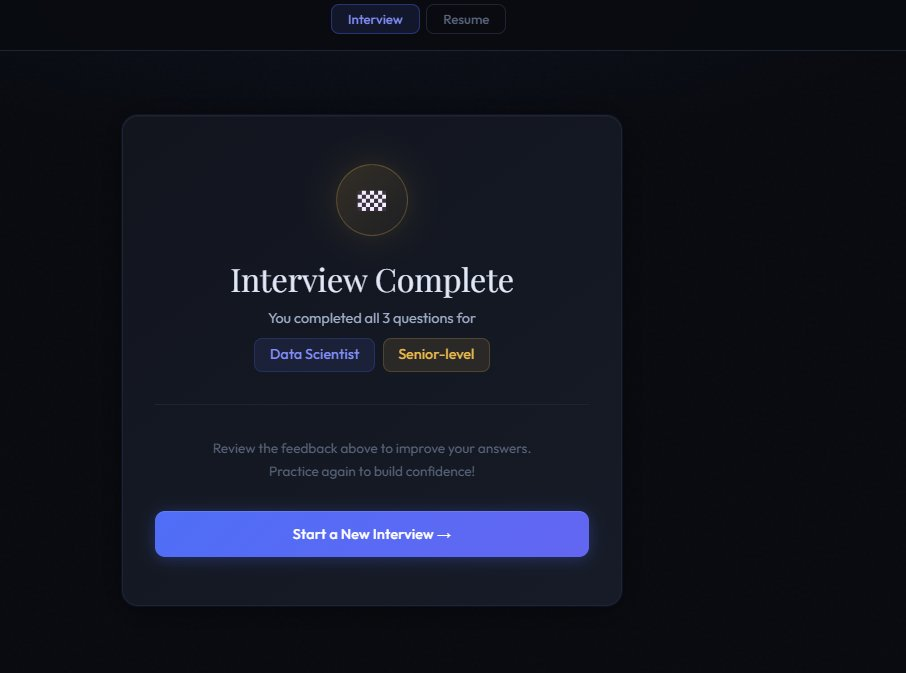
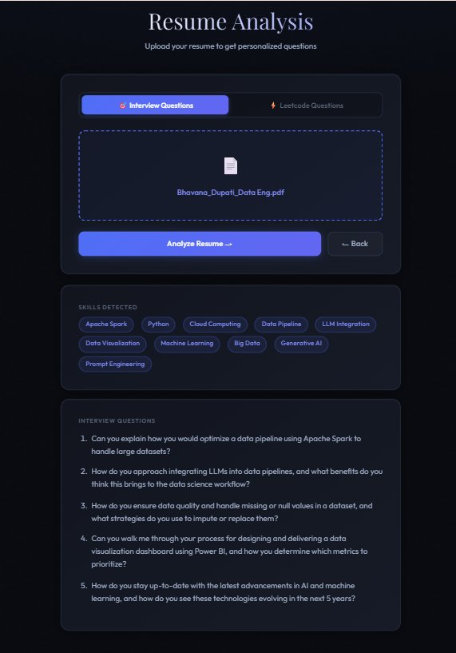
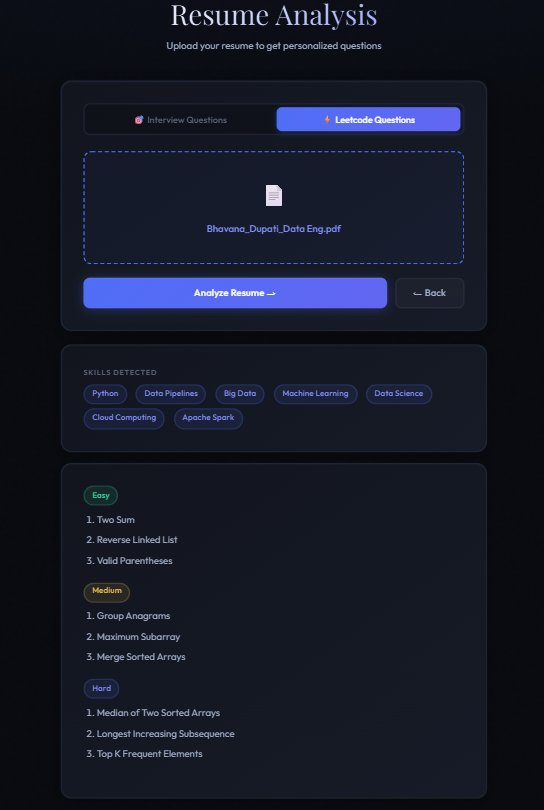
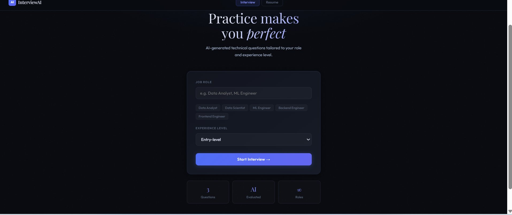

# AI Interview Agent

An AI-powered mock interview platform that generates technical interview questions, evaluates answers, analyzes resumes, and recommends personalized LeetCode problems for practice — built with FastAPI, React, and Groq LLM.
🌐 **Live Demo:** [ai-interview-agent-beta.vercel.app](https://ai-interview-agent-beta.vercel.app)

---

## 🏗️ Architecture

The project consists of two main components:

1. **FastAPI Backend** (`backend/`) — AI logic, Groq LLM integration, resume parsing
2. **React Frontend** (`frontend/`) — Premium dark UI built with Vite

### Data Flow

**Interview Flow:**
```
User selects Role + Level
        ↓
FastAPI → Groq LLM → Generate Question
        ↓
User submits Answer
        ↓
FastAPI → Groq LLM → Evaluate Answer
        ↓
Score + Feedback + Ideal Answer
        ↓
Next Question (repeat x3)
```

**Resume Analysis Flow:**
```
User uploads PDF Resume
        ↓
FastAPI → pypdf → Extract Text
        ↓
Groq LLM → Detect Skills
        ↓
Generate Questions / Leetcode Problems
(tailored to role + experience level)
```

---

## 📦 Project Structure

```
AI-Interview-Agent/
├── backend/
│   ├── models/
│   │   └── interview_model.py       # Pydantic request models
│   ├── routes/
│   │   ├── interview_routes.py      # Interview API endpoints
│   │   └── resume_routes.py         # Resume API endpoints
│   ├── services/
│   │   ├── interview_service.py     # Interview logic + Groq calls
│   │   └── resume_service.py        # Resume parsing + analysis
│   ├── main.py                      # FastAPI app + CORS
│   ├── requirements.txt             # Python dependencies
│   └── .env                         # API keys (not committed)
├── frontend/
│   ├── src/
│   │   ├── components/
│   │   │   ├── UI.jsx               # Reusable UI components
│   │   │   ├── StartScreen.jsx      # Role + level selection
│   │   │   ├── QuestionScreen.jsx   # Interview question + answer
│   │   │   ├── FeedbackScreen.jsx   # Score + AI feedback
│   │   │   ├── DoneScreen.jsx       # Interview complete screen
│   │   │   └── ResumeScreen.jsx     # Resume upload + results
│   │   ├── App.jsx                  # Main app + routing
│   │   ├── api.js                   # Axios API calls
│   │   ├── index.css                # Global dark theme styles
│   │   └── main.jsx                 # React entry point
│   ├── index.html
│   ├── package.json
│   └── vite.config.js
└── README.md
```

---

## 🚀 Features

- **AI Interview Simulation** — 3-question technical interview tailored to role and experience level
- **Answer Evaluation** — AI scores answers 0-10 with detailed feedback and ideal answer
- **Resume Analysis** — Upload PDF resume to get personalized interview questions based on your skills
- **Leetcode Recommendations** — Get easy, medium, and hard problems matched to your resume and target role
- **Session Memory** — Backend remembers role, level, and current question throughout the session
- **Premium Dark UI** — Polished interface with Playfair Display typography, progress indicators, and smooth animations
- **Fully Deployed** — Live on Vercel (frontend) + Render (backend)

---

## 📋 Prerequisites

- Python 3.11+
- Node.js 18+
- [Groq API key](https://console.groq.com) (free tier available)

---

## 🛠️ Local Setup

### 1. Clone the repository

```bash
git clone https://github.com/bhanudupati/AI-Interview-Agent.git
cd AI-Interview-Agent
```

### 2. Backend Setup

```bash
cd backend

# Create virtual environment
python -m venv venv
venv\Scripts\activate        # Windows
source venv/bin/activate     # Mac/Linux

# Install dependencies
pip install -r requirements.txt

# Create .env file
echo GROQ_API_KEY=your_groq_api_key_here > .env

# Start the server
uvicorn main:app --reload
# Runs on http://localhost:8000
```

### 3. Frontend Setup

```bash
cd frontend

# Install dependencies
npm install

# Start the dev server
npm run dev
# Runs on http://localhost:5173
```

---

## 📡 API Endpoints

### Interview

| Method | Endpoint | Description |
|--------|----------|-------------|
| POST | `/start-interview` | Start session, get first question |
| POST | `/submit-answer` | Submit answer, get score + feedback |
| POST | `/next-question` | Get next question |

### Resume

| Method | Endpoint | Description |
|--------|----------|-------------|
| POST | `/upload-resume` | Upload PDF, get interview questions |
| POST | `/generate-leetcode` | Upload PDF, get Leetcode problems |

### Example — Start Interview

**Request:**
```json
POST /start-interview
{
  "role": "Data Analyst",
  "level": "Entry"
}
```

**Response:**
```json
{
  "question_number": 1,
  "question": "Explain the difference between INNER JOIN and LEFT JOIN in SQL."
}
```

### Example — Submit Answer

**Request:**
```json
POST /submit-answer
{
  "answer": "INNER JOIN returns only matching rows from both tables..."
}
```

**Response:**
```json
{
  "score": 8,
  "feedback": "Good explanation! You could strengthen it by mentioning NULL handling in LEFT JOIN.",
  "correct_answer": "INNER JOIN returns rows with matching values in both tables. LEFT JOIN returns all rows from the left table and matched rows from the right, filling NULLs where there's no match."
}
```

---

## 🔧 Environment Variables

| Variable | Description | Required |
|----------|-------------|----------|
| `GROQ_API_KEY` | Groq API key from console.groq.com | Yes |

---

## 🌐 Deployment

### Backend — Render

1. Connect GitHub repo to [Render](https://render.com)
2. Set **Root Directory** to `backend`
3. Set **Build Command** to `pip install -r requirements.txt`
4. Set **Start Command** to `uvicorn main:app --host 0.0.0.0 --port 10000`
5. Add environment variable: `GROQ_API_KEY`
6. Set `PYTHON_VERSION` to `3.11.0`

### Frontend — Vercel

1. Connect GitHub repo to [Vercel](https://vercel.com)
2. Set **Root Directory** to `frontend`
3. Deploy — Vercel auto-detects Vite config

> **Note:** Update `frontend/src/api.js` `baseURL` to your Render backend URL before deploying frontend.

---

## 🧪 Tech Stack

| Layer | Technology |
|-------|-----------|
| Frontend | React 18, Vite, Axios |
| Backend | FastAPI, Python 3.11 |
| AI Model | Groq LLM (llama-3.3-70b-versatile) |
| PDF Parsing | pypdf |
| HTTP Client | httpx |
| Frontend Hosting | Vercel |
| Backend Hosting | Render |

---

## 📸 Screenshots

### Role & Experience Selection
Pick a target role (Data Analyst, Data Scientist, ML Engineer, Backend Engineer, Frontend Engineer, or your own custom role) and set your experience level — Entry, Mid, or Senior — to tailor the difficulty of the questions you'll receive.



### Interview Question Screen
Each session generates 3 role- and level-specific technical questions via the Groq LLM. The progress tracker shows your current question number, and the answer box includes a live character counter.



### AI Feedback & Scoring
After submitting an answer, the AI evaluates it on a 0–10 scale, provides a qualitative rating (e.g., "Excellent"), detailed feedback on what to improve, and an ideal model answer for comparison.



### Interview Complete
Once all 3 questions are answered, a summary screen confirms the session details (role and level) and offers the option to start a new interview for continued practice.



### Resume Analysis — Interview Questions
Upload a resume PDF to have the AI extract your skills (e.g., Apache Spark, Python, LLM Integration, Data Visualization) and generate personalized interview questions based on your actual experience.



### Resume Analysis — LeetCode Recommendations
Switch to the LeetCode tab to get Easy, Medium, and Hard coding problems curated specifically based on the skills detected in your resume — perfect for targeted technical prep.



### Start Screen
The landing page introduces the platform with a premium dark UI, an overview of how it works, and quick stats (3 questions per session, AI-evaluated, unlimited roles).



## 📄 License

This project is for portfolio and demonstration purposes.

---

## 🤝 Contributing

Contributions are welcome! Feel free to open issues or submit pull requests.

---

## 📧 Contact

**Bhavana Dupati**  
MS Computer Science — University of North Texas  
[GitHub](https://github.com/bhanudupati) · [LinkedIn](https://linkedin.com/in/bhavanadupati) . bhavanadupati3@gmail.com
